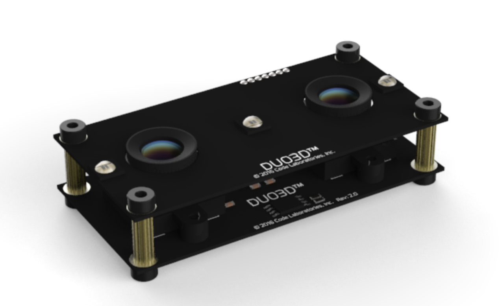

# Duo3D-Setup
Setting up the required software for Duo3D Camera

This repository helps in setting up the required software on Ubuntu 16.04 to work with the Duo3D MLX camera. 

  

**Most of this documentation is copied from the DUO's official manual.**

- Download the latest [DUO Software](https://drive.google.com/file/d/1QYQIDzuV23RlJEeVAne4mnD2MmMrOfC1/view?usp=sharing) to start using your device. On Linux the DUO requires a driver configuration which is included in the package.

- Before plugging the camera you must install the device driver and required libraries. 

	- Install Dependencies
		`sudo apt-get install build-essential qt5-default git cmake`
	- Install the driver
		You must build and load the DUO Kernel Module (`duo.ko`) for your version of Linux kernel. Go into the `CL-DUO3D-LIN-1.1.0.30/DUODriver/` folder and run the following:
		`chmod u+x duodriver.run
		./duodriver.run`
	- You can now use these commands to load, unload or install the module:
	Load the driver using `sudo insmod duo-1024.ko`. 

	*If Duo is connected to USB 3.0 port, use `sudo insmod duo-512.ko`*.

	If you need to ever unload the driver, use `sudo rmmod -f duo`.

	Once you determined that duo-1024 works, you can install the driver using following commands:
	`sudo cp duo-1024.ko /lib/modules/$(uname -r)/kernel/drivers/duo.ko
	echo 'duo' | sudo tee -a /etc/modules > /dev/null
	sudo depmod`

	If you are using the duo-512 then use the following commands:
	`sudo cp duo-512.ko /lib/modules/$(uname -r)/kernel/drivers/duo.ko
	echo 'duo' | sudo tee -a /etc/modules > /dev/null
	sudo depmod
	`

- Connect the DUO
Only after you have successfully installed the requirements then connect the DUO to your computer with the supplied USB cable.

To verify that the device is connected to the system you can view the node `duo0` appears in `/dev` directory on the file system.

- Start the Dashboard

Go to `CL-DUO3D-LIN-1.1.0.30/Apps/` and give DUODashboard executable permission using `chmod +x DUODashboard`. Now run the application. 

**If you don't see any image there is a problem.**

Now to use Duo3D with ROS, follow the instructions [here](http://wiki.ros.org/duo3d-driver).